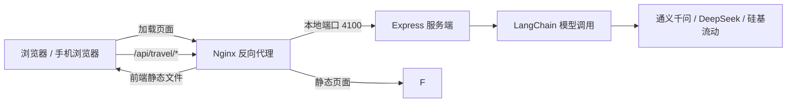

# AI 旅游推荐全栈项目

一个面向移动端的 AI 旅游规划应用。用户选择目的地、预算和旅行天数后，服务端调用大语言模型生成逐日行程；应用还提供旅游问答页面。

- 在线预览：[https://travel.dongjinyue.cn](https://travel.dongjinyue.cn)
- 服务健康检查：[https://travel.dongjinyue.cn/api/health](https://travel.dongjinyue.cn/api/health)
- GitHub 仓库：[dongjinyue/travel-recommendation-fullstack](https://github.com/dongjinyue/travel-recommendation-fullstack)

## 功能概览

- 选择目的地城市，填写总预算和旅行天数。
- 生成包含每日早、中、晚安排、景点介绍、交通建议、预算拆分和注意事项的行程。
- 在 AI 旅游助手页面以流式方式进行旅游问答。
- 提供首页、行程详情、AI 助手和个人中心页面。
- 支持通义千问（阿里云百炼）、DeepSeek 和硅基流动等兼容 OpenAI 接口的模型服务。

> 说明：个人中心目前是前端演示页面，菜单、登录和收藏等功能尚未连接真实账号或数据库。项目当前没有数据库，行程和聊天记录也不会持久保存。

## 技术结构



前端通过 `fetch` 读取服务端的 SSE（服务器发送事件）响应。聊天页会把收到的文本分片逐步追加到消息气泡中。行程详情页目前等到完整行程返回后才渲染行程，因此生成期间仍会显示加载动画；线上 Nginx 当前也没有显式关闭代理缓冲。

## 目录结构

```text
.
├── travel-h5/                 # Vue 3 + Vite 移动端前端
│   ├── src/
│   │   ├── components/        # 聊天气泡、景点卡片、预算表
│   │   ├── router/            # 页面路由
│   │   ├── stores/            # Pinia 状态管理
│   │   ├── utils/             # API 地址和请求 / SSE 解析
│   │   └── views/             # 首页、详情、聊天、个人中心
│   ├── .env.example           # 前端环境变量示例
│   └── package.json
├── travel-server/             # Node.js + Express 服务端
│   ├── src/
│   │   ├── routes/            # 旅游推荐与聊天 API
│   │   ├── services/          # 大语言模型调用和提示词
│   │   ├── utils/             # SSE 流式响应
│   │   └── index.js           # 服务入口和健康检查
│   ├── .env.example           # 服务端环境变量示例
│   └── package.json
├── .gitignore                 # 忽略密钥、依赖和构建产物
└── README.md
```

前后端是两个独立的 Node.js 应用，各自在自己的目录安装依赖。根目录没有统一启动脚本。

## 本地运行

### 环境准备

- Node.js：建议使用 Node.js 24（项目线上服务器当前使用 `v24.20.0`）。
- npm：随 Node.js 安装。
- 一个可用的模型服务 API Key（接口密钥），例如阿里云百炼的 DashScope API Key。

确认安装成功：

```powershell
node --version
npm --version
```

### 启动服务端

在第一个终端窗口中，从项目根目录运行：

```powershell
cd .\travel-server
npm ci
Copy-Item .env.example .env
```

编辑 `travel-server/.env`，至少设置 `MODEL_PROVIDER` 和相应模型服务的 API Key。使用通义千问时，配置示例如下：

```env
PORT=3000
MODEL_PROVIDER=qwen
DASHSCOPE_API_KEY=替换为你自己的百炼API密钥
QWEN_MODEL=qwen3.8-flash
QWEN_BASE_URL=https://dashscope.aliyuncs.com/compatible-mode/v1
```

API Key 只保存在本机 `.env` 文件里，不要提交到 GitHub，也不要粘贴到聊天或截图中。然后启动服务端：

```powershell
npm run dev
```

默认服务地址为 `http://localhost:3000`。健康检查地址为 `http://localhost:3000/api/health`。

### 启动前端

在第二个终端窗口中，从项目根目录运行：

```powershell
cd .\travel-h5
npm ci
Copy-Item .env.example .env
npm run dev
```

Vite（前端开发服务器）默认地址通常是 `http://localhost:5173`。开发配置会将 `/api` 请求代理到 `http://localhost:3000`，因此本地联调时一般不需要改 `VITE_API_BASE_URL`。

如果前后端分开部署，可以在 `travel-h5/.env` 设置：

```env
VITE_API_BASE_URL=https://你的服务域名/api/travel
VITE_APP_TITLE=旅行推荐
```

`VITE_` 开头的变量会被打包进浏览器代码，**只能放公开配置，不能放模型密钥**。

## 模型服务配置

服务端通过 `MODEL_PROVIDER` 选择模型提供商。

| `MODEL_PROVIDER` | 所需密钥 | 模型变量 | 默认接口地址 |
| --- | --- | --- | --- |
| `qwen` | `DASHSCOPE_API_KEY` | `QWEN_MODEL` | `https://dashscope.aliyuncs.com/compatible-mode/v1` |
| `deepseek` | `DEEPSEEK_API_KEY` | `DEEPSEEK_MODEL` | `https://api.deepseek.com/v1` |
| `siliconflow` | `SILICONFLOW_API_KEY` | `SILICONFLOW_MODEL` | `https://api.siliconflow.cn/v1` |

完整变量名和默认值见 [`travel-server/.env.example`](travel-server/.env.example)。切换模型时，修改服务端 `.env` 后重启服务端进程即可。模型名称需要与对应服务商账号当前可用的模型 ID 一致。

## API 接口

服务端默认端口是 `3000`；线上通过 Nginx 转发。以下路径均相对于站点域名。

### 健康检查

```http
GET /api/health
```

返回服务是否正常以及当前模型提供商名称。该检查只确认 Express 服务在运行，不会实际调用模型，也不验证 API Key 是否有效。

### 生成旅游行程

```http
POST /api/travel/recommend
Content-Type: application/json
```

请求示例：

```json
{
  "city": "北京",
  "budget": 3333,
  "days": 3
}
```

`city` 必填。`budget` 未提供或不是有效数字时服务端默认使用 `5000`；`days` 默认使用 `3`。首页会限制预算至少为 100 元、旅行天数为 1 至 30 天。

接口使用 SSE 返回以下事件：

```text
data: {"type":"chunk","content":"正在生成旅游规划..."}

data: {"type":"chunk","content":"模型生成的文本片段"}

data: {"type":"complete","data":{"success":true,"city":"北京", ...}}
```

`complete.data` 通常是解析后的行程对象，包含 `dailyItinerary`、`budgetBreakdown`、`tips` 和 `warnings` 等字段。模型输出无法解析为 JSON 时，`data` 会是原始文本。

### AI 旅游问答

```http
POST /api/travel/chat
Content-Type: application/json
```

请求示例：

```json
{
  "message": "北京三天旅行有哪些实用建议？"
}
```

该接口也使用 SSE。中间事件的 `type` 为 `chunk`；完成事件形如：

```json
{"type":"complete","data":{"success":true,"reply":"回答内容"}}
```

## 测试和生产构建

前端测试：

```powershell
cd .\travel-h5
npm test
```

前端生产构建：

```powershell
npm run build
```

构建产物位于 `travel-h5/dist/`。本地预览生产构建：

```powershell
npm run preview
```

前端目前配置了 API 基础地址相关测试。后端 `package.json` 中的 `test` 命令仍是未配置测试的占位脚本，不能作为后端测试使用。

## 当前线上部署

线上预览地址为 [travel.dongjinyue.cn](https://travel.dongjinyue.cn)，运行在腾讯云 Ubuntu 轻量云服务器上：

- 前端：Vite 构建后的静态文件，由 Nginx 提供，目录为 `/var/www/travel-recommendation`。
- 服务端：Express 监听本机 `4100` 端口，由 PM2 管理，进程名为 `travel-recommendation-server`。
- 接口转发：Nginx 将 `/api/` 请求代理到 `http://127.0.0.1:4100`。
- HTTPS：由 Certbot 管理站点证书和自动续期。
- 服务端配置：位于服务器旅游项目目录下的 `travel-server/.env`。密钥不应写入前端环境变量或代码仓库。

登录服务器后，可用以下命令查看和管理旅游服务：

```bash
export PATH="/home/ubuntu/.nvm/versions/node/v24.20.0/bin:$PATH"
pm2 status
pm2 logs travel-recommendation-server --lines 100
pm2 restart travel-recommendation-server --update-env
curl -fsS http://127.0.0.1:4100/api/health
```

命令用途：

- `pm2 status`：查看 PM2 管理的服务状态。
- `pm2 logs ... --lines 100`：查看该服务最近 100 行日志。
- `pm2 restart ... --update-env`：重新启动旅游服务并刷新进程环境变量；修改 `.env` 后使用。
- `curl .../api/health`：从服务器本机检查服务端健康状态。

发布前端更新时，先在 `travel-h5` 执行 `npm run build`，再将新的 `dist` 内容同步到静态站点目录。发布后端更新时，将服务端代码同步到旅游项目目录，再单独重启 `travel-recommendation-server`。不要使用会重启所有 PM2 进程的命令，因为同一服务器还运行着其他项目。

## 已知限制与维护提示

- 行程详情页虽连接了 SSE 接口，但当前 `onChunk` 回调为空，因此完整行程返回前页面不会逐步显示生成内容。聊天页面会逐片显示回答。
- 线上 Nginx 的 `/api/` 配置尚未显式关闭代理缓冲；这可能进一步降低 SSE 的实时显示效果。
- `travel-server/.env.example` 中有 `CORS_ORIGIN`，但目前服务端使用默认 `cors()` 中间件，没有读取该变量限制来源。若未来前后端使用不同域名，应在服务端明确配置允许的来源。
- 服务端会将模型输出分片写入 PM2 日志（`[Stream Chunk]`），日志可能包含生成内容并持续增长；正式长期运行时应评估日志脱敏、轮转和保留期限。
- 当前没有用户认证、数据库、行程收藏或历史持久化。浏览器里的个人中心数据是演示数据。
- 不要将 `.env`、访问令牌、API Key、SSH 私钥或证书提交到 Git。根目录 `.gitignore` 已忽略 `.env`、私钥文件及构建产物；公开给协作者前仍应检查提交内容。

## 常见问题

### 页面提示服务运行正常，但生成行程失败

健康检查不调用模型。请检查服务端 `.env` 的 `MODEL_PROVIDER` 和对应密钥是否匹配，例如 `MODEL_PROVIDER=qwen` 必须配置 `DASHSCOPE_API_KEY`；然后查看 PM2 日志。

### 页面一直显示“AI 正在为你生成行程”

先检查网络请求 `POST /api/travel/recommend` 是否返回 `200`，再查看服务器 PM2 日志。当前详情页要等完整结果才呈现行程；模型响应时间、Nginx 缓冲和 API Key/模型配置都会影响等待体验。

### 本地前端能打开，但接口报错

确认服务端已在 `3000` 端口运行，且前端 Vite 开发代理仍指向 `http://localhost:3000`。如果设置了 `VITE_API_BASE_URL`，检查地址是否包含 `/api/travel` 前缀。

### 如何确认线上版本和服务状态

打开 [线上健康检查接口](https://travel.dongjinyue.cn/api/health)。如果返回 `success: true`，表示服务进程可响应健康检查；若模型调用仍失败，需继续查看模型请求错误日志。
